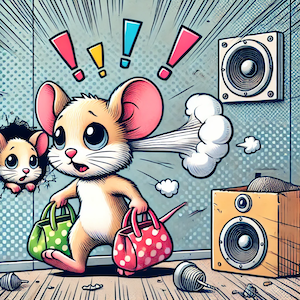

# Micebuster

 
To get rid of mice and rats without killing them.

## Background
Mice ant rats can hear ultrasound (e.g. sound above a frequency of 20000Hz), but humans can not. Apparently, mice and
rats do not like it if you play sound between 22kHz and 35hHz. So you can use audio to get rid of them. If
you use this repeatedly, they will simply go away and find another place to live.

However, since mice may become accustomed to a single frequency over time, the frequency
should be varied.

This simple Python script is designed exactly for that: randomly pitched sound at high frequencies.

## Warning
**Never use this near dogs, cats or any other pets or farm animals. Also, there is research showing ultrasound
frequencies might sometimes still be sensed by humans or could cause headaches.**

**Never use too loud sounds, especially in the frequencies of the human ear (note that younger people can hear higher 
frequencies). You might cause damage to the ear.**

## Requirements
### Hardware
You need a speaker that has enough power (dB) also at a range between 22kHz and 35kHz.
I use a HomePod Mini for this, although it seems to have quite a falloff already at 17-20kHz (
https://www.rtings.com/speaker/reviews/apple/homepod-mini ), so I use as default a frequency between 15kHz and 20kHz.

## Installation
- If you do not have Conda already, get it from, e.g., here: https://docs.anaconda.com/free/anaconda/install/index.html
- On Mac you need to do: `brew install portaudio`
- Clone the git repository: `git clone https://github.com/marcelmasi/micebuster.git`
- `cd micebuster`
- `conda env create -f environment.yml`

## Run
- If you are not already in the repo folder: `cd micebuster`
- `conda activate micebuster`
- `python audio_generator.py`

If you want to store the generated audio wave in a file, just add the flag `--save [filename]` where you replace
`[filename]` with the target wave file, e.g. `random_15kHz_to_20kHz.wav`.

You can also define the base frequency (`--low [frequency Hz]`) and the range (`--high [frequency Hz]`), where the
range between low and high define the frequency range for the uniformly generated random frequencies.

## Example File
There is an example file in the repository: [example_22kHz_to_35kHz.wav](example_22kHz_to_35kHz.wav)

Note that this file will not work on most speakers, since the frequencies are too high.

This is an example for speakers that do go up to 20kHz: [example_15kHz_to_20kHz.wav](example_15kHz_to_20kHz.wav)

**The above also holds for these files: never play them when other animals or people are around.**

## Copyright and License
See [LICENSE](LICENSE)
